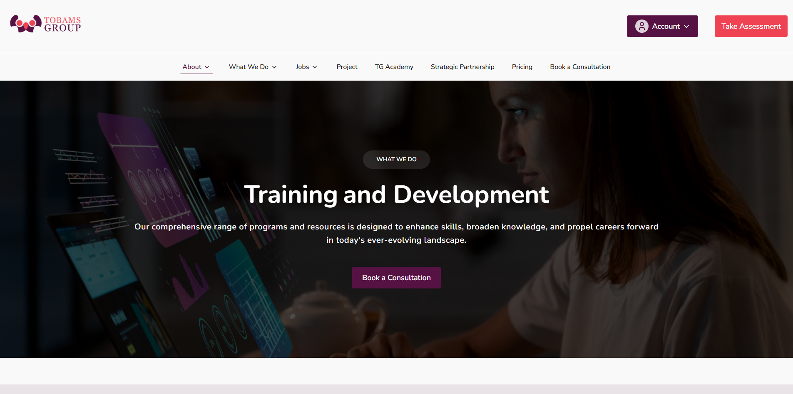

# Tobams Group: Training and Development

Frontend implementation of the Tobams Group Training and Development landing page based on the provided Figma design.

## Preview



## Live Demo

[View the live application](https://assurance-tobamsgroup.vercel.app/)

## Design Reference

[Figma Design](https://www.figma.com/design/wuqCLkK1feTgB6xxSRRwZu/Frontend-Intern-Assessment?node-id=1-1387&t=TiHnRIsEfjZKcig1-0)

## Tech Stack

• Next.js
• React
• TypeScript
• Tailwind CSS
• Framer Motion
• Next.js Image
• Next.js next/font

## Features

• Responsive landing page implementation
• Responsive navigation with mobile menu and dropdown interactions
• Training and development program sections
• Testimonials section
• Responsive layouts for mobile, tablet, and desktop
• Optimized image delivery using Next.js Image
• Local font loading using Next.js next/font
• Accessible interactive navigation and dropdown elements
• Subtle scroll based reveal animations using Framer Motion
• Responsive image loading states for improved perceived performance

## Accessibility

Accessibility was considered throughout the implementation.

• Semantic HTML elements are used to provide meaningful document structure.

• Interactive navigation elements use appropriate ARIA attributes such as `aria-expanded` and `aria-haspopup` where necessary.

• Dynamic interface updates use `aria-live` where appropriate.

• Decorative icons are hidden from assistive technologies using `aria-hidden="true"` or empty alternative text where applicable.

• Images containing meaningful information have descriptive alternative text. 

• Some Images have the property `placeholder='blur' ` that tells Next.js to show a blurred placeholder while the actual image is loading.

• Interactive elements are keyboard accessible with visible focus states.

• Heading hierarchy is maintained throughout the page.

• Reduced motion preferences are considered for animated elements.

## Design Decisions

### Component Structure

The page is divided into reusable components based on meaningful sections of the design. Repeated UI patterns are rendered from shared components while avoiding unnecessary abstractions.

### Static Content

Static and repeated content such as navigation items, training programs, testimonials, and footer links is maintained separately from the presentation components in `constants.ts`.

This keeps UI components focused on rendering and makes the content easier to maintain and update.

### Typography

Nunito and Nunito Sans are loaded using Next.js `next/font` and exposed through Tailwind CSS theme variables.

### Images

Local image assets are rendered using Next.js `Image` to provide optimized image delivery and responsive image handling.

Image loading states are also used where appropriate to avoid empty visual areas while assets are loading, particularly on slower network connections.

### Icons

Small interface icons are implemented as reusable SVG components where appropriate. Variants are supported when the same icon appears with different visual treatments in the design.

### Responsive Design

The layout uses Tailwind CSS responsive utilities and was implemented with the required mobile, tablet, and desktop viewports in mind, including the 425px viewport specified in the assessment.

### Animation

Framer Motion is used for subtle scroll based reveal animations to enhance the user experience without altering the underlying layout or visual hierarchy of the design.

Animations are intentionally restrained to maintain fidelity to the provided Figma design.

## Project Structure

The project follows a section based component structure suited to the scope of the landing page.

```text
app/
├── favicon.ico
├── globals.css
├── layout.tsx
└── page.tsx

components/
├── footer/
│   ├── CompanyDetails.tsx
│   ├── Contact.tsx
│   ├── Footer.tsx
│   ├── FooterCTA.tsx
│   ├── FooterLinks.tsx
│   └── LegalInformation.tsx
├── header/
│   ├── NavBar.tsx
│   └── NavItems.tsx
├── icons/
│   ├── ChevronDown.tsx
│   └── Lightning.tsx
├── sections/
│   ├── BookConsultation.tsx
│   ├── Hero.tsx
│   ├── LearningManagementSystem.tsx
│   ├── LearningWithCeo.tsx
│   ├── ManagementDevelopmentProgram.tsx
│   ├── Testimonials.tsx
│   ├── Trainings.tsx
│   └── TrainingTheConsultant.tsx
├── ui/
│   └── Button.tsx
└── Logo.tsx

public/
├── icons/
└── images/

constants.ts

```

The `components` directory is organized by responsibility, with header, footer, page sections, icons, and shared UI elements separated into their respective directories.

Static content shared across multiple sections is maintained in `constants.ts` at the project root. This keeps content separate from presentation logic without introducing additional data or utility layers that are unnecessary for the scope of this static landing page.

## Technical Assumptions

• The page is implemented as a static frontend without a backend or CMS.

• Navigation links that do not correspond to pages within the assessment are represented as placeholder links.

• Content and imagery are based on the information provided with the design reference.

• No external UI component libraries, CSS frameworks, or templates were used.

## Getting Started

### Prerequisites

Node.js 18.18 or later is recommended.

### Installation

This project uses **pnpm** as its package manager. I used pnpm instead of npm because it provides efficient dependency management by using a shared package store and a non-flat dependency structure, reducing unnecessary duplication across projects.

Using pnpm also ensures dependencies are installed according to the project's `pnpm-lock.yaml` file.

```bash
pnpm install
pnpm dev
```

Clone the repository:

```bash
git clone https://github.com/Aik-202/tobamsgroup-tg-academy
```

## Author

**Assurance Ikogwe**

Frontend Developer

[Portfolio](https://assuranceikogwe.vercel.app)